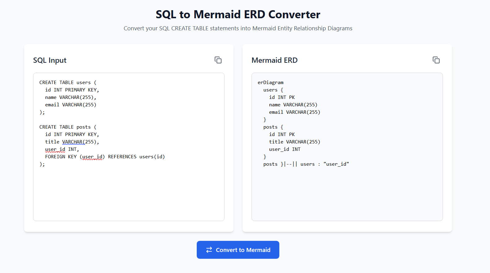

# SQL to Mermaid ERD Converter

A modern, user-friendly web application that converts SQL CREATE TABLE statements into Mermaid Entity-Relationship Diagrams (ERD). Built with React, TypeScript, and Tailwind CSS.



## Features

- 🔄 Real-time conversion from SQL to Mermaid ERD syntax
- 📋 Copy-to-clipboard functionality with visual feedback
- 🎨 Clean, modern UI with responsive design
- 💡 Example usage section with sample SQL
- ⚡ Fast and efficient client-side processing
- 🎯 Support for:
  - CREATE TABLE statements
  - Primary keys
  - Foreign key relationships
  - Table fields with types

## Getting Started

### Prerequisites

- Node.js (v14 or higher)
- npm or yarn

### Installation

1. Clone the repository:
```bash
git clone https://github.com/yourusername/sql-to-mermaid-erd.git
cd sql-to-mermaid-erd
```

2. Install dependencies:
```bash
npm install
```

3. Start the development server:
```bash
npm run dev
```

4. Open your browser and navigate to `http://localhost:5173`

## Usage

1. Paste your SQL CREATE TABLE statements into the left text area
2. Click the "Convert to Mermaid" button
3. The Mermaid ERD syntax will appear in the right text area
4. Copy the generated Mermaid code using the copy button
5. Use the Mermaid code in your preferred Mermaid renderer

### Example SQL Input

```sql
CREATE TABLE users (
  id INT PRIMARY KEY,
  name VARCHAR(255),
  email VARCHAR(255)
);

CREATE TABLE posts (
  id INT PRIMARY KEY,
  title VARCHAR(255),
  user_id INT,
  FOREIGN KEY (user_id) REFERENCES users(id)
);
```

## Development

### Tech Stack

- React 18
- TypeScript
- Vite
- Tailwind CSS
- Lucide React (for icons)

### Building for Production

```bash
npm run build
```

The built files will be in the `dist` directory.

### Linting

```bash
npm run lint
```

## Contributing

1. Fork the repository
2. Create your feature branch (`git checkout -b feature/AmazingFeature`)
3. Commit your changes (`git commit -m 'Add some AmazingFeature'`)
4. Push to the branch (`git push origin feature/AmazingFeature`)
5. Open a Pull Request

## License

This project is licensed under the MIT License - see the [LICENSE](LICENSE) file for details.

## Acknowledgments

- [Mermaid](https://mermaid-js.github.io/) - JavaScript based diagramming and charting tool
- [Tailwind CSS](https://tailwindcss.com/) - A utility-first CSS framework
- [Lucide](https://lucide.dev/) - Beautiful & consistent icons